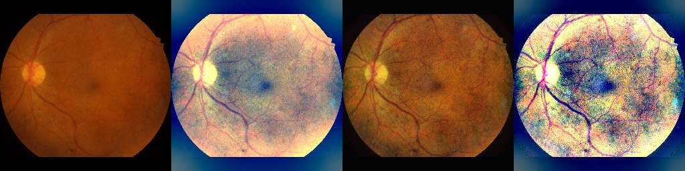

## Team10
- Gautham Mohan (st184914)
- Utsav Panchal (st184584)

## Diabetic Retinopathy Detection

To run the code you can type the following command in terminal  

```
sbatch batch.sh
```

You can change the model name nside the **'batch.sh** file under **'--model_name'** flag.  
Currently three models are available. 
1) **cnn_1**: Custom CNN model
2) **cnn_se**: Custom CNN model with squeeze and excitation blocks
3) **transfer_model**: Transfer learning model

Note: If you are using transfer learning model, make sure to update the base model name which you want to train in the **'configs/config.gin'** file under the parameter name **transfer_model.base_model_name = 'DenseNet121'** .
Currently three transfer learning models are available: 
1) **DenseNet121**: Dense Net model
2) **InceptionV3**: Inception Net V3 model 
3) **InceptionResnet**: Inception Resnet model 


## Image Preprocessing
The model was trained using different types of image processing methods.  
List of preprocessing methods we tried. 
1) Original (RGB) Images with cropped boundries
2) Bens preprocessing method: Add gaussian blur and subtract the local average
3) Enhance Local Contrast (CLAHE filtering)
5) Bens preprocessing + CLAHE

Out of all the preprocessing methods Original(RGB) and Bens preprocessing methods shown us promising accuracy.  

Starting from left: 1-2-3-4  

  

The type of image processing methods can be configured in **'configs/config.gin'**. 
```
preprocess_image.with_clahe = False
preprocess_image.with_bens = False
```


## Training and Evaluation
Here you can train different models as described above. 
```
python3 main.py --train --eval --model_name "cnn_se" 
```

## Evaluation
Make sure to provide evaluation checkpoint in **'configs/config.gin'**
```
python3 main.py --eval
```

## Wandb sweep
You can a run a sweep configuration for a particular model.  
Inside the **'sweep_configs/'** directory, different sweep configurations are available. Copy and paste the sweep into **'wandb_sweep.py'**. 
```
python3 wandb_sweep.py
```

## Ensemble learning
Make sure to provide checkpoints of the particular model inside **'ensemble.py'** file.  
```
python3 ensemble.py
```

# Results
We ran each model 10 times to see the variation in accuracy. The metric shown here is Sparse Categorical Accuracy(%).  
The logs are stored in **'good_performances/'** directory. 

|  | CNN_1 | CNN_SE | DenseNet121 | InceptionV3 | InceptionResnet |
| :---: | :---: | :---: | :---: | :---: | :---: |
| Run 1 | 82.52 | | 82.52 |  |  |
| Run 2 | 78.64 | | 82.52 |  |  |
| Run 3 | 77.67 | | 83.50 |  |  |
| Run 4 | 84.47 | | 83.50 |  |  |
| Run 5 | 77.67 | | 81.55 |  |  |
| Run 6 | 82.52 | | 82.52 |  |  |
| Run 7 | 81.55 | | 81.55 |  |  |
| Run 8 | 78.64 | | 82.52 |  |  |
| Run 9 | 79.61 | | 82.52 |  |  |
| Run 10 | 82.52 | | 82.52 |  |  |


The best performances metrics are shown below.  
Please note that it is difficult to reprocude the same accuracy because of limited dataset as seen above in 10 runs.   


|  | Accuracy (%) | Balanced Accuracy (%) | Sensitivity (%) | Specificity (%) | Recall (%) | Precision(%) | F1 Score(%) | AUC (%) | 
| :---: | :---: | :---: | :---: | :---: | :---: | :---: | :---: | :---: |
| CNN_1 |84.35 | 84.47 |  72.55 | 96.15 | 72.55 | 94.87 | 82.22 | 86.00 |
| CNN_SE | | |   |  |   |
| DenseNet121 | 83.50 | 82.36 | 76.19 | 88.52 | 76.19 | 82.05 | 79.01 | 83.00 |
| InceptionNet V3 |  |  |   |  | |
| InceptionResnet |  | |  | |  |


